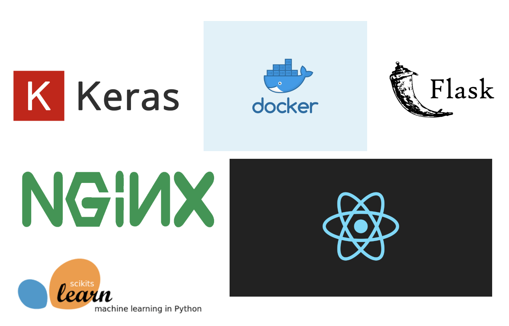

# Automatic Age Labeler for Voice Datasets

When creating machine learning models that incorporate voice, the age of the
speaker can be a very useful feature for downstream voice tasks. Categorizing
the age for unlabeled datasets can be very useful for creating models.

This application provides users an easy way of automatically labeling their voice
samples with the age category of the speaker. The user simply needs to attach mp3 files,
and press "upload" to download a CSV file with two columns: the filename, and the
age category.

This repository contains notebooks that detail the entire machine learning project,
including data preprocessing, exploratory data analysis, and modeling. It also
contains code for the frontend/API, which can be run using Docker.

## Directory Structure
```bash
├── ML-modeling                      # Notebooks with Keras models/analysis
├── data-prep                        # Data Preprocessing
├── eda                              # Basic Exploratory Data Analysis
├── presentation-slides              # Presentation from NeuroLex demo day
├── result-reports                   # Result Reports from 2018
├── webapp                           # Code for Web Application
    ├── client                       # client-side code
    ├── nginx                        # Reverse proxy for routing
    ├── server                       # Backend code                
├── .gitignore                       # Only push necessary files                 
├── Dockerrun.aws.json               # JSON for multi-container AWS deployment, not currently deployed
├── README.md                        # Readme that details the repo
├── docker-compose.yml               # Necessary to run the app on user machine
```

## Running the Application with Docker
```bash
docker-compose up --build
# now the app is running on localhost
```
### Update:
PyPI no longer supports building the dependencies that are needed to run the backend,
(numpy==1.19.5, scikit-learn==0.21.3, tensorflow==2.7.0). To run this container,
you will need to install Tensorflow 2.7 from the source within your virtualenv
or Docker container.

## References
- [Jim Schwoebel's Voicebook](https://github.com/jim-schwoebel/voicebook)

## Demo


## Further directions
If you are interested in getting involved with machine learning for audio analysis,
I recommend you check out [NeuroLex Labs](https://www.neurolex.ai/), which provides
voice computing services to clients, including machine learning. A special thanks to
Jim Schwoebel, the CEO of NeuroLex, for giving me direction and help with this project!

[Behavioral Signals](https://behavioralsignals.com/) is another interesting company
that detects emotion in voice with AI. The Director of ML at the company,
(Theodoros Giannakopoulos) developed pyAudioAnalysis, which is the library I used
to featurize the audio data.

## Technologies Used

